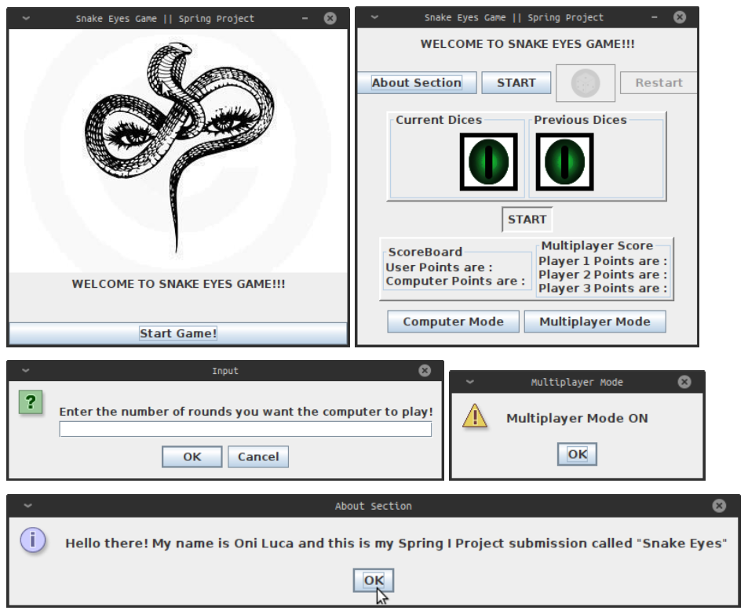

# Snake Eyes Game

## Overview
The Snake Eyes Game is a Java-based dice game designed as part of the CS 106 coursework. This interactive game simulates the excitement of rolling dice, featuring both single-player and multiplayer modes, and integrates various gameplay enhancements for an engaging experience.



## Gameplay Rules
### Single Player:
1. **First Roll:**
   - Win: If the sum of the dice is 7 or 11.
   - Lose: If the sum is 2, 3, or 12.
   - Point: If the sum is 4, 5, 6, 8, 9, or 10, it becomes the "point."
2. **Subsequent Rolls:**
   - Win by rolling the "point" before rolling a 7.
   - Lose by rolling a 7 before the "point."

### Multiplayer and Computer Modes:
- Players take turns or compete with an AI-controlled player.
- Scoreboard tracks the progress and scores of all participants.

## Features
- **Dynamic Dice Simulation:**
  - Custom dice graphics designed in Photoshop.
  - Interactive dice rolls with instant feedback.
- **Modes:**
  - Single Player, Multiplayer (up to 3 users), and Computer AI mode.
- **Score System:**
  - Points awarded for winning based on the number of rolls:
    - +10 points for a win on the first roll.
    - +(10-x) points for winning after x rolls.
  - Points deducted for losses:
    - -5 points for losing on the first roll.
    - -3 points for losing after multiple rolls.
- **User Interface:**
  - Interactive UI using Java Swing with multiple layout managers (CardLayout, FlowLayout, BoxLayout, and BorderLayout).
  - Hover pop-ups for tooltips and instructions.
- **Game Options:**
  - Restart, Roll Again, About Section, and dynamic pane transitions.

## Technologies Used
- **Programming Language:** Java
- **Framework:** Java Swing for GUI
- **Graphics:** Photoshop (for dice and icons)

## Installation

1. Clone the repository:
   ```bash
   git clone https://github.com/OJOCoding/SnakeEyesGame.git
   cd SnakeEyesGame
   ```

2. Open the project in your preferred Java IDE (e.g., IntelliJ IDEA, Eclipse, or NetBeans).

3. Compile and run the program:
   ```bash
   javac SnakeEyesGame.java
   java SnakeEyesGame
   ```

## Project Structure
```plaintext
SnakeEyesGame/
├── src/                # Source code
│   ├── SnakeEyesGame.java  # Main game class
│   ├── Gui.java            # GUI and gameplay logic
│   └── ...                 # Additional helper classes
├── assets/             # Images and icons
├── README.md           # Project documentation
└── LICENSE             # License file
```

## How to Play
1. Launch the application.
2. Choose a mode: Single Player, Multiplayer, or Computer AI.
3. Follow on-screen instructions to roll dice, track scores, and manage gameplay.
4. Use the scoreboard to monitor progress across multiple rounds.

## Contributing
Contributions are welcome! To contribute:
1. Fork the repository.
2. Create a new branch for your changes:
   ```bash
   git checkout -b feature-name
   ```
3. Commit your changes and push to your fork.
4. Open a pull request detailing your updates.

## License
This project is licensed under the [MIT License](LICENSE).

## Contact
For any questions or support, please reach out:
- GitHub: [OJOCODING](https://github.com/OJOCODING)
- Email: [oniluca@ymail.com](mailto:oniluca@ymail.com)

---

We hope you enjoy playing the Snake Eyes Game! Roll the dice and test your luck!
